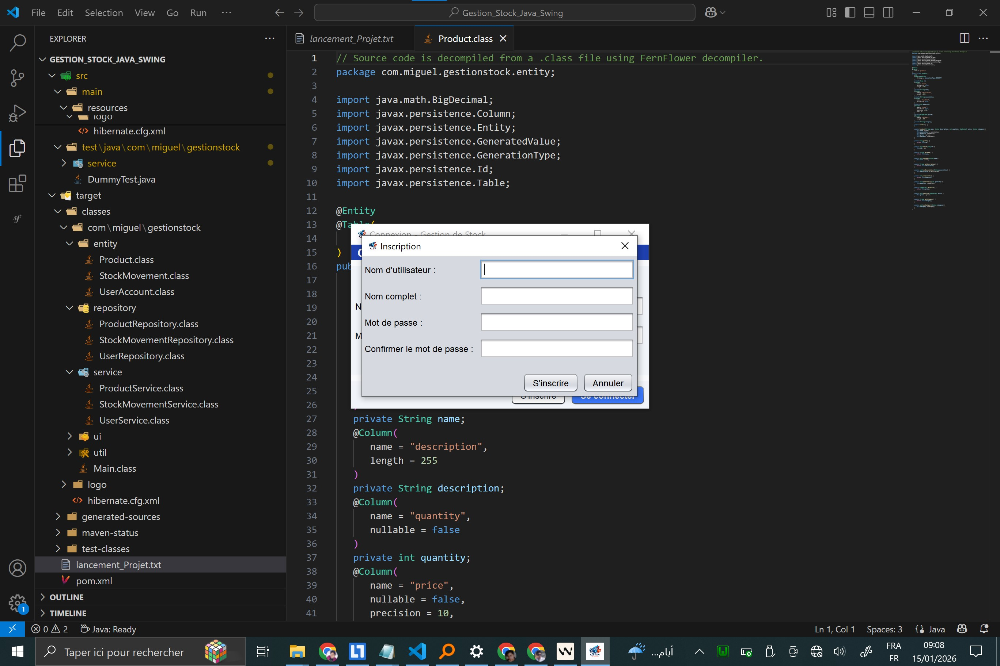
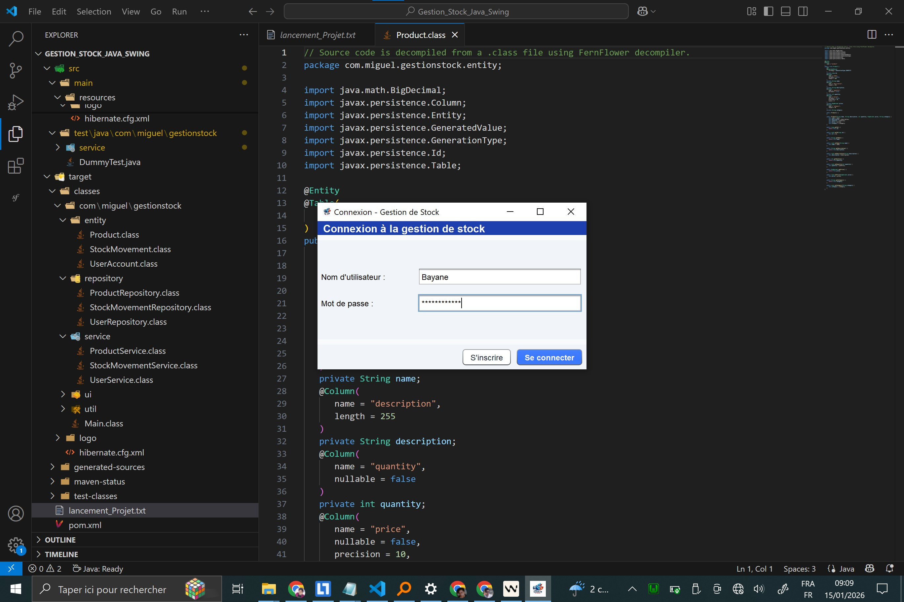
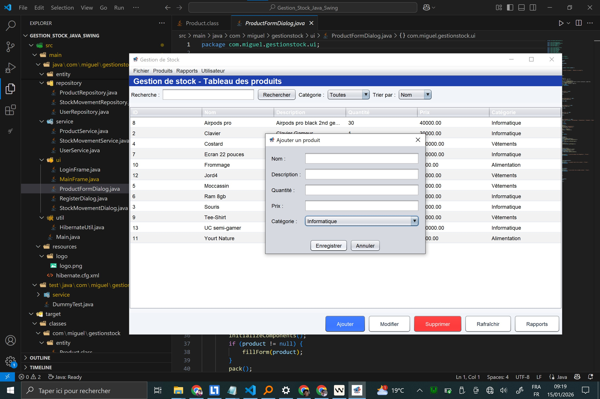
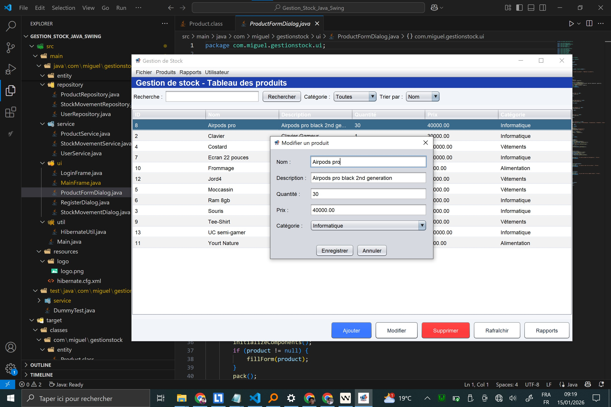
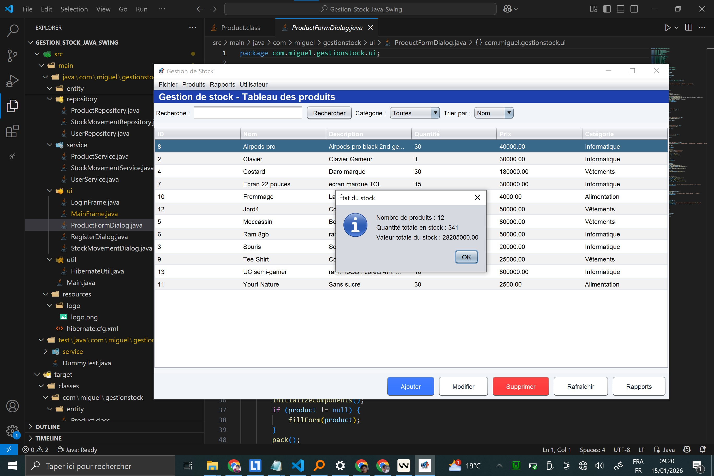
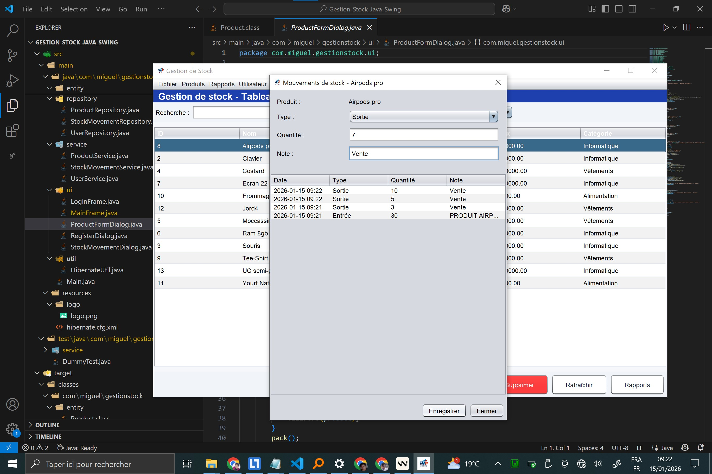
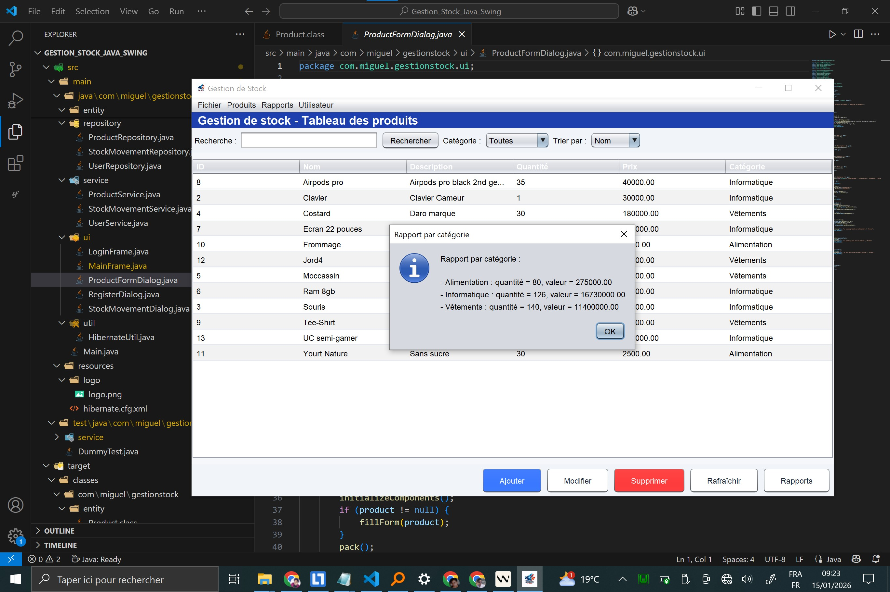
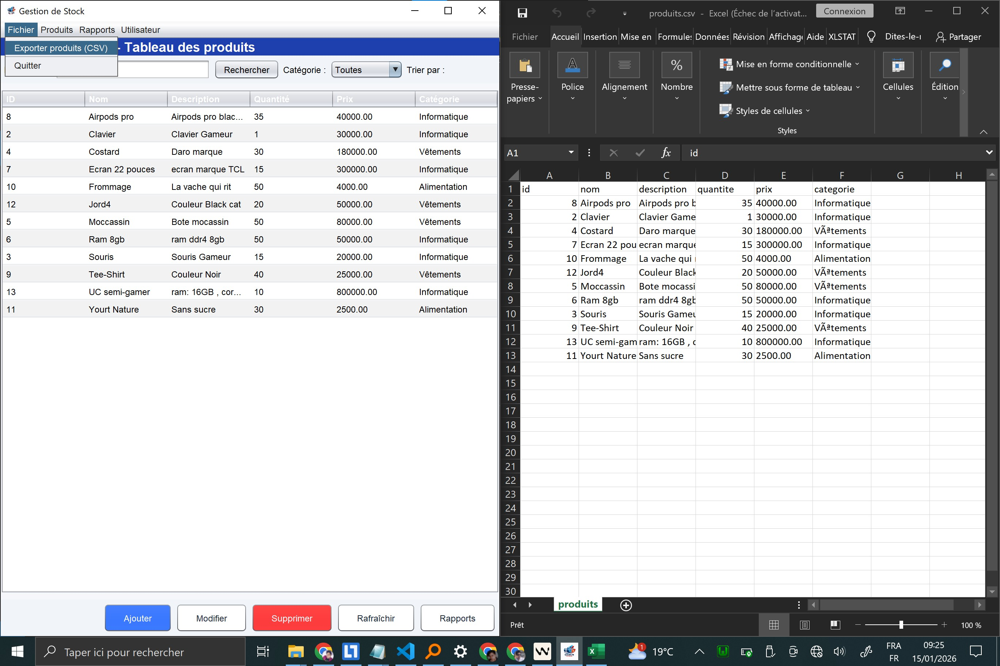

# Gestion_Stock_Java_Swing

Application de **gestion de stock** développée en Java Swing avec Hibernate et MySQL.
Ce projet est pensé comme un projet "vitrine" pour recruteurs : interface moderne, gestion des produits, mouvements de stock, rapports, authentification, et tests unitaires.

---

## 🎯 Fonctionnalités principales

- **Authentification utilisateur**
  - Inscription (création de compte avec mot de passe haché, SHA-256).
  - Connexion et déconnexion.
- **Gestion des produits (CRUD)**
  - Ajout, modification, suppression de produits.
  - Champs : nom, description, quantité, prix, catégorie.
  - Validation côté service (quantité et prix positifs, nom obligatoire).
- **Recherche / filtre / tri**
  - Recherche par nom.
  - Filtre par catégorie (Informatique, Alimentation, Vêtements, …).
  - Tri par nom / prix / quantité.
- **Mouvements de stock**
  - Enregistrement des **entrées** et **sorties** de stock.
  - Historique des mouvements par produit.
  - Mise à jour automatique de la quantité en stock.
  - Protection contre les stocks négatifs.
- **Rapports**
  - État global du stock (nombre total de produits, quantité totale, valeur totale).
  - Produits en **rupture / sous seuil** (alerte).
  - Rapport **par catégorie** (quantité + valeur par catégorie).
- **Alertes & export**
  - Alerte automatique des produits en stock faible au démarrage.
  - Export **CSV** de tous les produits.
- **Tests**
  - Tests JUnit pour `ProductService` et `StockMovementService` (validation et logique métier).
- **UI**
  - Interface Swing modernisée (couleurs, boutons stylés, tableau, etc.).
  - Icône de l’application personnalisée (`logo/logo.png`).

---

## 🛠️ Stack technique

- **Langage** : Java 8
- **Interface graphique** : Swing
- **ORM** : Hibernate 5
- **Base de données** : MySQL
- **Tests** : JUnit 5
- **Build** : Maven

---

## 🗄️ Structure du projet (simplifiée)

```text
Gestion_Stock_Java_Swing/
├── pom.xml
├── src
│   ├── main
│   │   ├── java
│   │   │   └── com/miguel/gestionstock
│   │   │       ├── Main.java
│   │   │       ├── entity/
│   │   │       │   ├── Product.java
│   │   │       │   ├── StockMovement.java
│   │   │       │   └── UserAccount.java
│   │   │       ├── repository/
│   │   │       ├── service/
│   │   │       ├── ui/
│   │   │       │   ├── LoginFrame.java
│   │   │       │   ├── RegisterDialog.java
│   │   │       │   ├── MainFrame.java
│   │   │       │   ├── ProductFormDialog.java
│   │   │       │   └── StockMovementDialog.java
│   │   │       └── util/
│   │   └── resources
│   │       ├── hibernate.cfg.xml
│   │       └── logo/logo.png
│   └── test
│       └── java
│           └── com/miguel/gestionstock/service
│               ├── ProductServiceTest.java
│               └── StockMovementServiceTest.java
├── logo/
└── screenshoots/
```

---

## 💾 Configuration base de données

- SGBD : **MySQL**
- Base : `gestion_stock`
- Utilisateur : `root`
- Mot de passe : *(vide)*

Configuration Hibernate (`src/main/resources/hibernate.cfg.xml`) :

- URL : `jdbc:mysql://localhost:3306/gestion_stock?useSSL=false&serverTimezone=UTC`
- `hibernate.hbm2ddl.auto=update` (création/mise à jour automatique des tables).

Avant de lancer l’application :

1. Démarrer MySQL (WAMP / XAMPP / autre).
2. Créer la base de données :

```sql
CREATE DATABASE gestion_stock CHARACTER SET utf8mb4 COLLATE utf8mb4_unicode_ci;
```

---

## 🚀 Lancer l’application

À la racine du projet :

```bash
mvn -q -DskipTests=true compile
mvn -q -DskipTests=true exec:java
```

L’application démarre sur l’écran de **connexion** (`LoginFrame`).

---

## 👤 Authentification

1. **Inscription**
   - Bouton `S'inscrire` sur l’écran de connexion.
   - Saisie : nom d’utilisateur, nom complet, mot de passe, confirmation.
   - Mot de passe haché en SHA-256 et stocké dans la table `user_account`.

2. **Connexion**
   - Saisie nom d’utilisateur + mot de passe.
   - Si les identifiants sont valides, ouverture de la fenêtre principale `MainFrame`.

3. **Déconnexion**
   - Menu `Utilisateur → Se déconnecter` dans la fenêtre principale.

---

## 📦 Gestion des produits

Dans `MainFrame` :

- Tableau listant les produits : ID, Nom, Description, Quantité, Prix, Catégorie.
- Boutons :
  - `Ajouter` : ouverture du formulaire `ProductFormDialog`.
  - `Modifier`
  - `Supprimer`
  - `Rafraîchir`
  - `Rapports`
- Recherche / filtre / tri en haut de la fenêtre.

---

## 🔄 Mouvements de stock

Depuis un produit sélectionné :

- Menu `Produits → Mouvements de stock`.
- Ouverture de `StockMovementDialog` :
  - Sélection du **type** : Entrée / Sortie.
  - Saisie de la **quantité** et d’une note optionnelle.
  - Historique listé (date, type, quantité, note).
- La quantité du produit est mise à jour automatiquement avec protection contre les stocks négatifs.

---

## 📊 Rapports et export

Menu **Rapports** :

- `État du stock` :
  - Nombre de produits, quantité totale, valeur totale.
- `Par catégorie` :
  - Quantité et valeur par catégorie.
- `Ruptures de stock` :
  - Produits avec quantité ≤ seuil (par défaut 5).

Menu **Fichier** :

- `Exporter produits (CSV)` :
  - Exporte tous les produits dans un fichier CSV.
  - Format : `id;nom;description;quantite;prix;categorie`.

---

## 🧪 Tests

Exécution des tests :

```bash
mvn test
```

Tests principaux :

- `ProductServiceTest` :
  - Création produit valide → ID généré.
  - Création produit invalide (nom manquant, quantité/prix négatifs) → `IllegalArgumentException`.
- `StockMovementServiceTest` :
  - Entrée de stock → quantité augmente.
  - Sortie de stock → quantité diminue.
  - Sortie trop grande (stock négatif) → exception et rollback.

---

## 🖼️ Screenshots

Les captures d’écran se trouvent dans le dossier `screenshoots/`.

```markdown
### Écran d'inscription


### Écran de connexion


### Liste des produits


### Ajout de produit


### Modification de produit


### Rapport - État du stock


### Mouvements de stock


### Rapport par catégorie


### Export CSV

```

---

## 🧩 Améliorations possibles

- Gestion de rôles (ADMIN / USER).
- Gestion multi-utilisateurs avec audit des mouvements.
- Packaging en JAR exécutable.
- Internationalisation (FR / EN / MG).
